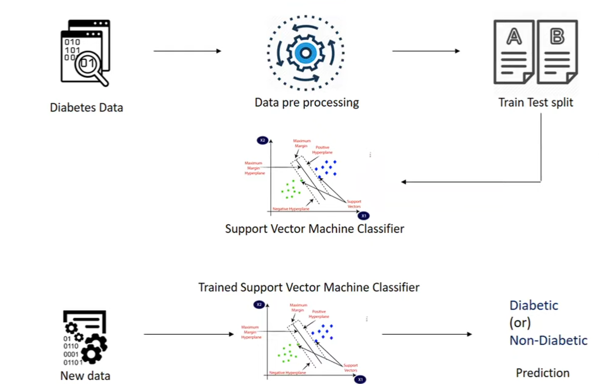
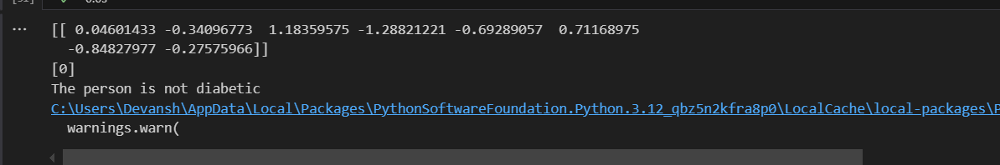

# Diabetes_prediction

In this project i have created a model using support vector machine (SVM) that can predict if a person has diabetes or not. 

### Workflow 

 

1. Diabetes Data collection - 

The dataset contains medical records with various health parameters that influence diabetes prediction. 

2. Data preprocessing - 

To ensure the quality of input data, steps applied are - 

* Handling missing values
* Normalization or standardization of features 
* Encoding categorical data.

3. Train - test split 

The dataset is divided into training and testing subsets to evaluate the model's performance. Typically, an 80-20% or 70-30% split is used, where the larger portion is used for training the model, and the smaller portion is reserved for validation and testing.

4. Support Vector Machine (SVM) Classifier

The SVM classifier is trained using the training dataset. SVM works by finding the optimal hyperplane that best separates the two classes (Diabetic and Non-Diabetic) while maximizing the margin between them.

5. Model training and optimization 

The SVM model is trained using a suitable kernel function. Hyperparameter tuning is performed to optimize the classifier for better accuracy.

6. Making prediction on New data 

Once the model is trained, it is used to classify new patient data as either Diabetic or Non-Diabetic based on their medical attributes.

7. Final prediction output 

The trained model outputs a classification label:

* Diabetic
* Non-Diabetic

